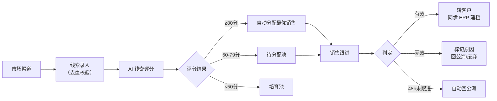
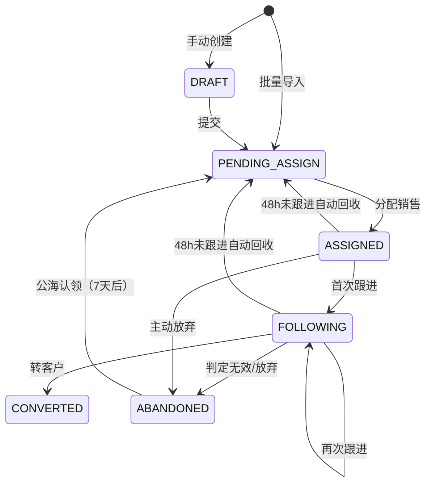

# 线索主PRD

> **版本**：V1.0 | 2026-07-17
> **读者**：研发工程师、测试工程师、产品复核

---

## 1. 业务背景

线索是 CRM 的入口，解决"从哪来的、是不是目标客户、谁来跟、跟了没有"四个核心问题。

没有统一的线索管理：
- 市场投放来的名单靠 Excel 传来传去，谁跟了、跟到什么程度无从追踪
- 同一家公司被多个销售跟进，客户体验极差
- 有质量的线索淹没在大量无效名单里，无人优先处理
- 销售离职/调岗，线索跟着流失，交接成本高
- 线索转化率靠感觉，无法用数据驱动分配策略

---

## 2. 功能范围

**In Scope：**
- 线索录入（手动创建 + Excel 批量导入）
- 线索去重（手机号/邮箱唯一性校验）
- 线索池与公海
- 线索分配（手动分配 + AI 评分自动分配）
- 超时回收（48h 未跟进自动回公海）
- 线索跟进记录
- 线索转客户（同步 ERP 建档）
- 线索废弃/放弃

**Out of Scope：**
- 营销自动化（短信/邮件群发、广告归因）—— 一期不涉及
- 线索清洗（重复合并、数据补全）—— 一期不支持，交给人工
- 线索评分模型的自学习调优 —— 一期使用固定权重，调优归二期

---

## 3. 对象定位

### 3.1 在系统中的位置

| 项目 | 内容 |
|------|------|
| 对象类型 | 线索（营销获客层） |
| 核心职责 | 管理从市场投放获取的潜在客户信息，通过分配+跟进判断质量，合格的转客户 |
| 来源 | 手动创建 / Excel 导入 |
| 下游对象 | 客户（转客户时同步 ERP 建档） |
| 关联关系 | 一条线索可转为一个客户（1:1），转客户后可创建多个商机（1:N） |

### 3.2 系统链路图

---

## 4. 业务场景

| 场景ID | 场景 | 类型 | 说明 |
|--------|------|------|------|
| S01 | 手动录入线索并分配 | **主流程** | 市场人员录入一条线索，AI评分后自动分配 |
| S02 | Excel批量导入线索 | **主流程** | 展会/活动后批量导入，跳过评分直接进待分配池 |
| S03 | 销售跟进后转客户 | **主流程** | 销售联系后判定有效，转为正式客户 |
| S04 | 超时未跟进自动回收 | **异常** | 分配后48h未跟进，自动回公海 |
| S05 | 销售主动放弃线索 | **支线** | 销售判定无效，填写原因后放弃 |
| S06 | 公海认领 | **支线** | 其他销售从公海认领被放弃的线索 |
| S07 | 重复线索拦截 | **异常** | 录入时手机号/邮箱已存在，阻断并提示 |

---

## 5. 状态机

### 5.1 对象状态

| 状态 | 含义 | 是否终态 |
|------|------|:--------:|
| DRAFT | 草稿（仅手动录入时有） | 否 |
| PENDING_ASSIGN | 待分配（批量导入默认此状态） | 否 |
| ASSIGNED | 已分配（销售已认领） | 否 |
| FOLLOWING | 跟进中（销售已首次联系） | 否 |
| CONVERTED | 已转客户 | 是 |
| ABANDONED | 已作废/已放弃 | 是 |

### 5.2 状态机图

### 5.3 状态流转表

| 当前状态 | 动作 | 前置条件 | 结果状态 | 后置影响 |
|----------|------|---------|---------|---------|
| DRAFT | 提交 | 必填字段完整 | PENDING_ASSIGN | 触发 AI 评分 |
| PENDING_ASSIGN | 管理员分配 | 目标销售在职 | ASSIGNED | 记录分配人+分配时间 |
| ASSIGNED | 添加跟进记录 | 无 | FOLLOWING | 更新最近跟进时间 |
| FOLLOWING | 转客户 | 线索无重复 | CONVERTED | 同步 ERP 建档，通知销售 |
| FOLLOWING | 放弃 | 必填放弃原因 | ABANDONED | 记录放弃原因+时间 |
| ASSIGNED | 放弃 | 必填放弃原因 | ABANDONED | 同上 |
| ASSIGNED | 超时回收 | 距分配>48h 且无跟进 | PENDING_ASSIGN | 清除归属人 |
| FOLLOWING | 超时回收 | 距上条跟进>48h | PENDING_ASSIGN | 清除归属人 |

### 5.4 动作能力矩阵

| 动作 | DRAFT | PENDING_ASSIGN | ASSIGNED | FOLLOWING | CONVERTED | ABANDONED |
|------|:-----:|:-----:|:-----:|:-----:|:-----:|:-----:|
| 查看 | ✅ | ✅ | ✅ | ✅ | ✅ | ✅ |
| 编辑 | ✅ | ❌ | ❌ | ❌ | ❌ | ❌ |
| 分配 | ❌ | ✅ | ❌ | ❌ | ❌ | ❌ |
| 跟进 | ❌ | ❌ | ✅ | ✅ | ❌ | ❌ |
| 转客户 | ❌ | ❌ | ❌ | ✅ | ❌ | ❌ |
| 放弃 | ❌ | ❌ | ✅ | ✅ | ❌ | ❌ |
| 删除 | ✅ | ❌ | ❌ | ❌ | ❌ | ❌ |

---

## 6. 核心业务规则

| 规则ID | 规则 |
|--------|------|
| R01 | 手机号/邮箱去重：同一手机号或邮箱不可重复创建线索 |
| R02 | 超时回收：分配后 48 小时未跟进 → 自动回公海 |
| R03 | 公海保护：同一线索被同一销售放弃后 7 天内不可再次认领 |
| R04 | 转客户时，CRM 先创建客户快照，再通知 ERP 正式建档 |
| R05 | 已转客户的线索不可编辑、不可放弃、不可回收 |
| R06 | 已作废的线索仅列表展示，不可操作；7 天后可被公海认领 |

---

## 7. AI 串联规则

| AI 节点 | 触发时机 | 输入维度 | 输出 | 执行动作 |
|---------|---------|---------|------|---------|
| 线索评分 | 线索提交时 | 来源(15%)+行业匹配(20%)+响应速度(25%)+历史转化(25%)+活跃度(15%) | 0-100分 | ≥80自动分配，50-79待分配池，<50培育池 |

---

## 8. 权限设计

| 角色 | 可见数据范围 | 可执行操作 |
|------|------------|-----------|
| 销售 | 自己名下的线索 + 公海可见 | 跟进、转客户、放弃、认领公海线索 |
| 销售主管 | 团队全部线索 | 分配、回收、查看报表 |
| 管理员 | 全部线索 | 全部操作 + 规则配置 |

---

## 9. 验收重点

| # | 验收项 | 输入条件 | 预期结果 |
|---|--------|---------|---------|
| V01 | 去重阻断 | 录入已存在的手机号 | 阻断并提示"该手机号已存在线索 XXX" |
| V02 | AI评分触发 | 提交草稿线索 | 自动生成评分并进入对应池 |
| V03 | 超时回收 | 分配后48h无跟进 | 线索状态回 PENDING_ASSIGN，归属人清空 |
| V04 | 转客户同步 | 跟进中转客户 | CRM客户快照创建，ERP建档通知发送 |
| V05 | 公海保护 | 放弃7天内再次认领 | 阻断并提示"该线索7天内不可认领" |

---

## 10. 修订记录

| 日期 | 变更摘要 |
|------|---------|
| 2026-07-17 | V1.0 初版 |
